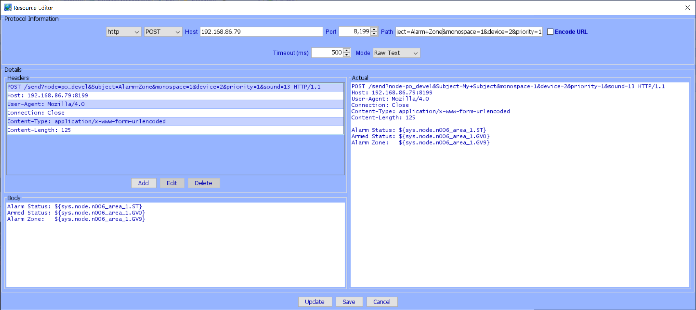

# Polyglot V2 ELK Nodeserver

## Important Notices

I am not responsible for any issues related to this nodeserver including missing an alarm!  However I have been using this in my production enviorment for many months and have had no issues.

## Why use this when ISY has the ELK module?

The ELK Module will not be available on Polisy, the node server will be the supported method.

The node server also has advantages.  It creates a node for Areas, Zones, ... So you can put those nodes in scenes, or use them in programs just like any other node.

This node server works great with the new UD Mobile app for Android and iOS!


## Help

If you have any issues are questions you can ask on [PG3 ELK SubForum](https://forum.universal-devices.com/forum/309-elk/) or report an issue at [PG3 ELK Github issues](https://github.com/UniversalDevicesInc-PG3/udi-poly-ELK/issues).

## Moving from PG2

There are a few ways to move

### Backup and Restore

The best way to move from PG2 to PG3 is to backup on PG2 and restore on PG3, but the only option is to do all your nodeservers at once.  I don't have much information on this method, if you have questions please ask on the PG3 forum.

### Delete and add

If you can't or don't want backup/restore then you can delete the NS on PG2 and install on the same slot on PG2.  All node addresses will stay the same so all your programs should work after doing an update and save on each one, or rebooting the ISY, especially any using the Controller node since it's ST value has changed.  Just remember to capture the config information before deleting.

### Add then delete

Another option is to install in a new slot then go edit all your programs and scenes that reference the nodes and switch to the new slots. 

## Installation

Install from the Polyglot store.

### Configuration

Open the Configuration Page for the Nodeserver in the Polyglot UI and view the [Configuration Help](/POLYGLOT_CONFIG.md) available on that page.

After setting configuration then restart the nodeserver and all configured areas will be added.   There is a Node for each Area, and the Zone's for that area are grouped under it.  Sometimes the ISY fails to actually group some of the nodes, if you notices Zone's not grouped, then right click on it and select Group, which will fix them all.

## Requirements

This uses https://github.com/gwww/elkm1 which currently only supports an M1EXP in local non secure mode.

## Using this Node Server

### General notes

If the Elk objects have characters in the name which are not allowed in ISY Node Names, those charcters will be stripped.

If you change a Elk object name it will not be automatically reflected on the ISY (currently).  You will have to delete the node in the Polyglot UI Node's page for the node server, then restart the node server.

If there is an alarm event, sending a "disarm" with the node server turns off the alarm, but does not reset it, just like when you do it at the Elk keypad.  You will have to send another "disarm" to reset it.  This is mentioned for users of UD Mobile who may want to disarm reset the sytem after an alarm.

#### Syncing profile changes

When the Nodeserver starts up and finishes the sync with the Elk Panel it will build a custom profile which currently contains a list of your user names.  This allows showing the real user name instead of user number.  If you change, add or remove user names you must restart the nodeserver to have them reflected on the ISY.  Also, close and re-open the Admin console if it was open while the nodeserver was restarting.

### Nodes

#### ELK Controller

This has the following status:
- NodeServer Online
  - Nodeserver up and running
- ELK M1EXP Status: This was changed in version 3.3.0 and due to a bug in PG3 the driver will not update, so you must delete the controller node in the PG3 UI.  If you have any output nodes, you have to delete those first then delete the controller.  On every long poll the node server will check the conneciton and change it to Connected/Disconnected which will override the other status.
  - Connected: When a successful connection to the ElkM1 is completed.
  - Disconnect: When a connection to a panel is disconnected.
  - Login Sucess: When a login is made to the panel (only when using elks:// connection mode, which is not supported yet in the node server)
  - Login Failed: 
  - Sync Complete: When the panel has completed synchonizing all its elements.
  - Timeout: When a send of a message to the ElkM1 times out (fails to send).
  - Unknown: When a message from the ElkM1 is received and the library does not have a method to decode the message. 
- Logger Level
  - Defines how much logging information is printed.

#### Area Node

By default only the area one, is added, change the areas configuraion if you have more than one.  The areas are 1-8, and the node names will match the names defined on your ELK.  They contain the following:
- Alarm Status
  - If there is an Alarm
    - No Alarm Active
    - Entrance Delay is Active
    - Alarm Abort Delay Active
    - Fire Alarm
    - Medical Alarm
    - Police Alarm
    - Burglar Alarm
    - Aux 1 Alarm
    - Aux 2 Alarm
    - Aux 3 Alarm
    - Aux 4 Alarm
    - Carbon Monoxide Alarm
    - Emergency Alarm
    - Freeze Alarm
    - Gas Alarm
    - Heat Alarm
    - Water Alarm
    - Fire Supervisory
    - Verify Fire
- Armed Status
  - The current Armed status, can be controlled by the ISY
    - Unknown
      - Only set to this on startup until the status is Known, not settable by user.
    - Disarmed
    - Armed Away
    - Armed Stay
    - Armed Stay Instant
    - Armed Night
    - Armed Night Instant
    - Armed Vacation
    - Armed Next Away Mode (Probably should show this in Set list?)
    - Armed Next Stay Mode (Probably should show this in Set list?)
    - Force Arm To Away Mode (Need to test what this does, bypass?)
    - Force Arm To Stay Mode (Need to test what this does, bypass?)
- Arm Up State
  - The current Arm Up State
    - Unknown (Only on startup)
    - Not Ready To Arm
    - Ready To Arm
    - Ready To Force Arm
    - Armed With Exit Timer
    - Armed Fully
    - Force Armed
    - Armed With Bypass
- Last User
  - The last user to access any keypad with a code.  See "Syncing profile changes" section for more information.
- Chime Mode
  - Unknown
  - Silent
  - Single Beep
  - Constantly Beeping
  - Single Beep while Constantly Beeping
  - Single Chime
  - Single Chime with Single Beep
  - Single Chime with Constantly Beeping
  - Single Chime with Single Beep and Constantly Beeping
- Additional Trigger
  - The ELK only sends a triggered zone when a violated zone actually triggers an alarm. If this option is True, which is the default, the Nodeserver will also set Last Triggered Zone when an approriate zone is violated and the ELK is in an Alarm State.
    - If Enabled:
      - In Stay, Away, Night and Vacation Mode, set triggered for any Entry/Exit Delay Nodes when they are violated.
      - In Night mode, set triggered for Night Delay Nodes when they are triggered
- Poll Voltages
  - Enabled to poll the voltages on the Area's Zones.  The ELK doesn't push voltages changes, they must be polled.  By default this is False.  Enabling this creates more traffic so it is off by default.  You can query individual zones to get updates in a program, or enable to have then updated with each short poll.  If you set this to True, you must also enable the Poll Voltage on each zone that you want voltages to be updated.  This polling is doen on short poll intervals.
- Zones Violated
  - The number of Zones currently in Logical Status of Violated, regardless of the Armed Status. This does not mean the zone caused an Alarm, it only means the zone logical status is Violated
- Zones Bypassed
  - The number of Zones currently in Logical Status of bypassed
- Last Violated Zone
  - This is the last zone whose status logical status was Violated, this doesn't mean it caused an Alarm, only means it went Violated
- Last Triggered Zone
  - The zone has caused an alarm to be triggered.  This comes directly from the ELK when the zone is not an entry/exit, or optionally the node server will trigger for other cases. See Additional Trigger above for more informaition.
- Display Message
  Send Text to Keypads in Area
  - Beep: True or False to Beep while displaying the message
  - Clear: 
    - Display until Timeout
      - If timeout not specified, or specified as zero then no timeout
    - Clear Message with * key
      - Allow user to clear message with the * key
    - OFf Timer
      - Specify seconds to show message for
    - Content
      - The Custom Conent from Configuration -> Emails/Notifications -> Customizations
        - If only sending one line then use subject
        - If sending 2 lines then use body and leave subject empty
          - Each line limited to 16 characters
- Clear Message
  - Clears the current message

#### Keypad Node

There is a Keypad node for each keypad found and they are by default grouped under the Area Node they are assigned to. Keypads contain the following.

- Keypad Status
  - Currently always True, may be used in the future
- Last User
  - The last user to enter access code at the keyboard, which is also propagated up the the Area Last User
- Temperature
  - The temperature from the keypad, or -40F is keypad doesn't report temperature.


#### Zone Node

Currently every Zone in the Area will be added as a Node if the Zone Definition is greater than Zero.  They are grouped under the Area node they are assigned to.  Nodes contain the following:

- Physical Status
  - UNKNOWN
  - Unconfigured
  - Open
  - EOL
  - SHORT
- Logical Status
  - UNKNOWN
  - Normal
  - Trouble
  - Violated
    - Note: This does not meant the zone caused an Alarm, it only means the zone logical status is Violated regardless of the Armed Status.
  - Bypassed
- Voltage
  - The current Zone Voltage.  Note this is not updated on change, it must be Polled.  By default this is polling is disabled, to enable set "Poll Voltages" on the Zone's Area.  The values are only updated on Short Poll intervals, which can be set in the Node Server Configuration Page.  It is also updated on a Zone query, so you can write ISY progrmas to force the query if you want faster updates, or just to update a single zone.
- Triggered Alarm
  - The zone has caused an alarm to be triggered.  This comes directly from the ELK and only turns on if the zone triggers and alarm immediatly, if the zone has entry delay it will not set triggered when zone is violated, or when entry delay times out causing an alarm.
    - True
    - False
- Area
  - The Area number the Zone is part of.
- Type
  - The Zone Type configured in the ELK, 37 different choices
- Send On For / Send Off For
  - Allow configuring of when the On and/or Off control signals are sent for the Zone Physical Status changes. This allows you to put the Node in a Scene and by default an On is sent when the Zone changes to Open, and an Off is sent when Zone changes to.  But this can be changed with these options:
    - Ignore
    - Open
    - EOL
    - Short
- Use Off Node
  - Setting this to True will create the Zone Off Node for this Zone, see Zone Off Node below for more information.
- Poll Voltage
  - If the Area Poll Voltage is enabled, then setting this to True for the Zone will poll the voltage on each short poll.

#### Zone Off Node

By default only a Zone node is created.  When you enable a Zone "Use Off Node" this will create another node for that Zone which is sent the "Off" commands.   This allows you to have separate nodes for On and Off so they can be in different Scenes if desired.  This is conveinent for turning on a scene when a door opens, but not turning it off when the door closes.  You could also sent 'Send Off For' to None as well, if you never care about the off control message being sent.

#### Light Node

There will be a Light node created under the Controller for each Light that is not using the default name.  So if you named the light in the ELK it will show up.

This does not yet include support which the ISY had for [Support ELK Export](https://github.com/UniversalDevicesInc-PG3/udi-poly-ELK/issues/67).  Please comment on that issue if you would like it supported.

#### Output Node

There will be an Ouput node created for each Output you have listed in the outputs range.  The output is named based on the name in the Elk and has status (ST) showing On, Off, or Unknown.  The Unknown value should only happen when the output is first added until the Elk is queried to get the status.

When an Ouput is turned On or Off, a Control is also sent so you can put the node in a scene, or use Control in a ISY program.

When turning on an ELK output you can specify the seconds as zero which will keep the output on, or set the On Time to the number of seconds to wait before turning off.  You can set the 'Default' time which will be used every time you turn it on, or you can Turn on With Time for a one time execution.

It has these options/commands:
- Default On Seconds
  - The default time the output stays on when turned on, zero means latching so it stays on until turned off
- Turn On for ... Seconds
  - This is one command to turn on for the specified seconds, or zero for latching

The output node can be put in a scene as a controller and when the ELK turns it on or off it can control the scene.

#### Counter Node

There will be a Counter node created under the Controller for each Counter that is not using the default name.  So if you named the counter in the ELK it will show up.

The counter value can be set directly, incremented or decremented.  Currently it is not possible to set the value to zero.

#### Task Node

There will be a Task node created under the Controller for each Task that is not using the default name.  So if you named the task in the ELK it will show up.

The Task has a Status which is currently meaningless, but someday will show the date/time of last execution when ISY supports it.

The only command for a task is Activate

## Using the Nodeserver

Following are examples have usages for this nodeserver.

### Notifications

To include any information about a Zone in a notification you can use any if these drivers:
```
Area: ${sys.node.n004_area_1.name}
 Alarm Status:        ${sys.node.n004_area_1.ST}
 Armed Status:        ${sys.node.n004_area_1.GV0}
 Arm Up State:        ${sys.node.n004_area_1.GV1}
 Last Violated Zone:  ${sys.node.n004_area_1.GV8}
 Last Triggered Zone: ${sys.node.n004_area_1.GV9}
 Chime Mode:          ${sys.node.n004_area_1.GV2}
 Zones Violated:      ${sys.node.n004_area_1.GV3}
 Zones Bypassed:      ${sys.node.n004_area_1.GV4}
 Last user:           ${sys.node.n004_area_1.GV6}
 Last Keypad:         ${sys.node.n004_area_1.GV7}

${sys.node.n004_zone_1.name} ${sys.node.n004_zone_1.status}
${sys.node.n004_zone_2.name} ${sys.node.n004_zone_2.status}
...
```

### Triggered Zone

The new Area Last Triggered Zone makes it easy to send a notification for Zone which started an alarm.  I use the Notificaiton Nodeserver so the program looks like this:
```
ELK Alarm Zone - [ID 0025][Parent 0001]

If
        'ELK / Home' Last Triggered Zone is not Unknown

Then
        Resource 'ELK Alarm Zone'

Else
   - No Actions - (To add one, press 'Action')
```
The notification resource is also very simple as shown in the Network Resource.


This can be adapated to your prefered notification method.


## TODO and issues

https://github.com/UniversalDevicesInc-PG3/udi-poly-ELK/issues

## Release Notes
- 3.3.4: 06/05/2022
  - Fix heartbeat being sent twice per long poll
  - Remove creation of Threads for long and short poll, no longer needed since PG3 runs each in a new thread anyway.
- 3.3.3: 06/05/2022
  - Fix: [Output Nodes sending DON/DOF during query](https://github.com/UniversalDevicesInc-PG3/udi-poly-ELK/issues/75)
- 3.3.2: 05/10/2022
  - Fix issues with renameing nodes.  Requires PG3 3.0.62 and udi_interface 3.0.45
- 3.3.1: 05/09/2022
  - Bug: Fix Task query
- 3.3.0: 05/08/2022
  - Enhancement: [Add Driver for all the ELK status from the lib](https://github.com/UniversalDevicesInc-PG3/udi-poly-ELK/issues/7)
    - See [ELK M1EXP Status](https://github.com/UniversalDevicesInc-PG3/udi-poly-ELK/blob/master/README.md#elk-controller)
  - Enhancement: [Add Elk Lights](https://github.com/UniversalDevicesInc-PG3/udi-poly-ELK/issues/45)
    - See: See [Light Node](https://github.com/UniversalDevicesInc-PG3/udi-poly-ELK/blob/master/README.md#light-node)
  - Enhancement: [Add Elk Counters](https://github.com/UniversalDevicesInc-PG3/udi-poly-ELK/issues/49)
    - See: See [Counter Node](https://github.com/UniversalDevicesInc-PG3/udi-poly-ELK/blob/master/README.md#counter-node)
  - Enhancement: [Add Elk Tasks](https://github.com/UniversalDevicesInc-PG3/udi-poly-ELK/issues/51)
    - See: See [Task Node](https://github.com/UniversalDevicesInc-PG3/udi-poly-ELK/blob/master/README.md#task-node)
  - Enhancement: [Query should update voltages](https://github.com/UniversalDevicesInc-PG3/udi-poly-ELK/issues/66)
    - Added Zone Poll Voltages setting which if enabled will Poll the Voltage on each short poll when the Area Poll Voltage is enabled.
    - A query on a node will always poll the voltage even if Poll Voltage is False.
  - Fix: [Allow output to control a scene](https://github.com/UniversalDevicesInc-PG3/udi-poly-ELK/issues/73)
- 3.2.8: 05/05/2022
  - Added configuration setting change_node_names.  If set to true then ISY node names will be changed to match the ELK.  Default is true.
- 3.2.7: 04/14/2022
  - Fix invalid init value which caused issues for UD Mobile
- 3.2.6: 04/06/2022
  - Move connecting to elk to after add node is complete to try and avoid race condition with setting m1exp connected state.
  - Remove internal get/set Driver methods on controller
  - Force set connected status after sync completes due to race condition on node startup
  - Removed remenants of old logger level driver
- 3.2.3: 04/05/2022
  - Add more debugging to trace issue with ELK M1EXP Connection going False
  - Upgraded elmk1_lib to 1.2.0
- 3.2.2: 04/03/2022
  - Fixed issue with profile for UD Mobile, but UD Mobile will need to add support for new _sys_short editor.
- 3.2.1: 04/01/2022
  - Fixed: [Remove non-ascii characters from display message](https://github.com/UniversalDevicesInc-PG3/udi-poly-ELK/issues/72)
- 3.2.0: 03/31/2022
  - Added [Send text to keypads](https://github.com/UniversalDevicesInc-PG3/udi-poly-ELK/issues/13)
- 3.1.4: 03/08/2022
  - Fix stop to call poly stop so it should quit properly when PG3 tells it to.
- 3.1.3: 03/06/2022
  - Fixed: [Fix support for All Alarm Status](https://github.com/UniversalDevicesInc-PG3/udi-poly-ELK/issues/71)
    - Should be fixed, but not tested for all values
- 3.1.2: 02/13/2022
  - Build a profile even when no ELK is all defined.
- 3.1.1: 02/12/2022
  - Query of controller no longer queries all nodes since the ISY Query program which typically runs every morning at 3am
    will query the controller and all other nodes which created a lot of extra traffic.
- 3.1.0: 02/10/2022
  - [Send speak to panel from list of defined phrases or words](https://github.com/UniversalDevicesInc-PG3/udi-poly-ELK/issues/57)
- 3.0.13: 01/14/2022
  - Add more debugging info to stop and restart
- 3.0.12: 01/02/2022
  - More reorganization to try and fix issues with user settable values not being restored
- 3.0.11: 01/01/2022
  - add nodequeue so only one node is added a a time to try and fix issues, but not working yet
- 3.0.10: 01/01/2022
  - Update to udi_interface 3.0.28
- 3.0.9: 12/28/2021
  - Update to udi_interface 3.0.27
- 3.0.8: 12/26/2021
  - Removed setting debug mode from controller, existing users need to delete controller node in polyglot UI before restarting NS
- 3.0.7: 12/26/2021
  - Back to using conn_status on controller now that udi_interface 3.0.26 fixes the issues
- 3.0.6: 12/25/2021
  - Fix setting controller.ST on startup
  - Fix creating off_node
- 3.0.5: 12/23/2021
  - Remove new controller status, seems to be broken in udi interface 3.0.25
- 3.0.4: 12/23/2021
  - Add status for controller needed to show True, False, Failed
  - Users on older PG3 versions will need to delete DB and recreate for it to work.
- 3.0.3: 12/23/2021
  - Update to latest udi_interface
- 3.0.2: 11/23/2021
  - Fix crash during query
- 3.0.1: 11/22/2021
  - Change how thread is started so ELK has it's own event loop
  - This should fix issues with restarting sometimes failing
- 3.0.0: 11/14/2021
  - Initial conversion to PG3
- 0.5.17: 06/27/2021
  - Enhancement: [Test bad login](https://github.com/jimboca/udi-poly-elk/issues/4)
  - Confirmed and Closed: [Test disconnect](https://github.com/jimboca/udi-poly-elk/issues/5)
  - Confirmed: [Test elkm1 lib 1.0.0](https://github.com/jimboca/udi-poly-elk/issues/61)
- 0.5.16: 06/26/2021
  - Fix Bug trying to enable/disable Additional Trigger MOde
- 0.5.15: 06/19/2021
  - Fixes for Additional Trigger mode
- 0.5.14: 06/17/2021
  - Fix profile error from 0.5.12
- 0.5.13: 06/17/2021
  - Bug Fixed: [Zone query causes controller to crash](https://github.com/jimboca/udi-poly-elk/issues/59)
- 0.5.12: 05/23/2021
  - Enhancement for: [Violated Zone Reporting Armed Stay Mode vs Elk M1 Reporting](https://github.com/jimboca/udi-poly-elk/issues/40)
    - Add Last Triggered Zone and Entry/Exit Trigger option.  Please provide feedback.
- 0.5.11: 04/30/2021
  - Fixed: [discover called incorrectly for runCmd](https://github.com/jimboca/udi-poly-elk/issues/20)
  - Enhancement for: [Violated Zone Reporting Armed Stay Mode vs Elk M1 Reporting](https://github.com/jimboca/udi-poly-elk/issues/40)
    - Now properly set Zone GV1 "Triggered Alarm" when a zone triggers an alarm
- 0.5.10: 04/28/2021
  - Fix when initial elk alarm_state is empty
- 0.5.6 - 0.5.9: 04/06/2021
  - Fixed to show proper temperature: [Keypad: Only show temperature if the keypad has a sensor](https://github.com/jimboca/udi-poly-elk/issues/52)
- 0.5.5: 04/06/2021
  - Fixed: [Keypad: Only show temperature if the keypad has a sensor](https://github.com/jimboca/udi-poly-elk/issues/52)
- 0.5.4: 04/05/2021
  - Fixed: [Can not turn off "use off node"](https://github.com/jimboca/udi-poly-elk/issues/56)
  - Enhancement: [Keypad: Allow showing C or F](https://github.com/jimboca/udi-poly-elk/issues/53)
  - Enhancement: [Keypad: Only show temperature if the keypad has a sensor](https://github.com/jimboca/udi-poly-elk/issues/52)
    - I can not test this, so I need someone with a temperature sensor in a keypad to confirm
  - Documentation: [Violated Zone Reporting Armed Stay Mode vs Elk M1 Reporting](https://github.com/jimboca/udi-poly-elk/issues/46)
    - Added notes in README about Violated.
- 0.5.3: 02/27/2021
  - [Area: Add Last Violated Zone](https://github.com/jimboca/udi-poly-elk/issues/55)
  - Set user names for Version 4.4.2 and later, user code 201 = Program Code, 202 = ELK RP Code, 203 = Quick Arm, no code
  - Fix Max values to correct max, not minus 1
- 0.5.2: 02/22/2021
  - Put short/long poll in their own threads so they don't block others
  - Do not set last user keypad in area last_log
- 0.5.1: 02/19/2021
  - [Add Elk Keypads](https://github.com/jimboca/udi-poly-elk/issues/48)
    - Added debug when keypad is not added for debugging
  - [Add support for last user](https://github.com/jimboca/udi-poly-elk/issues/47)
    - Fix setting last_user on keypads when it happens
    - Set User 203 name to "No Code User"
  - [Keypad: Add last keypad to Area](https://github.com/jimboca/udi-poly-elk/issues/54)
- 0.5.0: 02/17/2021
  - [Add Elk Keypads](https://github.com/jimboca/udi-poly-elk/issues/48)
    - Added, but can't do function keys yet, need to add support to Python elkm1 library
  - [Add support for last user](https://github.com/jimboca/udi-poly-elk/issues/47)
    - Added for Keypads and Area
- 0.4.3: 02/09/2021
  - [Support Outputs and Virtual Outputs](https://github.com/jimboca/udi-poly-elk/issues/12)
    - Change wording from Time to Seconds, profile and doc change only.
- 0.4.2: 02/08/2021
  - [Support Outputs and Virtual Outputs](https://github.com/jimboca/udi-poly-elk/issues/12)
    - Fixed Output On/Off values
    - Fix crashed when outputs is null.
- 0.4.1: 02/08/2021
  - [Support Outputs and Virtual Outputs](https://github.com/jimboca/udi-poly-elk/issues/12)
    - Add missing Output.py file.
- 0.4.0: 02/07/2021
  - [Support Outputs and Virtual Outputs](https://github.com/jimboca/udi-poly-elk/issues/12)
- 0.4.0: 02/07/2021
  - [Add support for Zone voltage](https://github.com/jimboca/udi-poly-elk/issues/38)
    - Poll Voltages for Zones when Area Enables Poll Voltages setting.
- 0.3.2: 02/05/2021
  - [DOF not sent for EOL](https://github.com/jimboca/udi-poly-elk/issues/42)
    - Removed Send On/Off functionality
    - Added 'Send On For' default=Open 'Send Off For' default=EOL so users can control
- 0.3.1: 02/05/2021
  - Only wording changes for Arm Up State [Word Wrap Text Box](https://github.com/jimboca/udi-poly-elk/issues/44)
- 0.3.0: 02/04/2021
  - [Improve how violated/bypassed zones are counted](https://github.com/jimboca/udi-poly-elk/issues/40)
  - [Add support for Zone voltage](https://github.com/jimboca/udi-poly-elk/issues/38)
    - But currently on startup the voltage is always zero, it only updates occasionally when panel sync is done.
    - Asked on the elkm1_lib if this is a know issue [Voltage is not initialized on startup](https://github.com/gwww/elkm1/issues/40)
- 0.2.8: 01/29/2021
  - Update polyinterface requirement to latest.
- 0.2.7: 01/21/2021
  - Fix logging when setting Zone ST & GV0
  - Change DON/DOF to Send On / Send Off in documentation and in nodeserver nls
  - [DOF not sent for EOL](https://github.com/jimboca/udi-poly-elk/issues/42)
    - Always send DOF for EOL and Short
- 0.2.6: 01/16/2021
  - Fix [All Zones in an Area are being added to ISY](https://github.com/jimboca/udi-poly-elk/issues/37)
- 0.2.5: 01/15/2021
  - Fix [Illegal characters or empty zone name issues](https://github.com/jimboca/udi-poly-elk/issues/35)
- 0.2.4: 01/14/2021
  - Fix [Illegal characters or empty zone name issues](https://github.com/jimboca/udi-poly-elk/issues/35)
  - Change logical and physical status [Logical vs Physical State](https://github.com/jimboca/udi-poly-elk/issues/34)
  - Fix [Don't print Unknown message EM errors](https://github.com/jimboca/udi-poly-elk/issues/30)
- 0.2.3: 01/05/2021
  - Fix profile
- 0.2.2: 01/04/2021
  - Add better logging to see what is happening
- 0.2.1: 01/04/2021
  - Add BaseNode so all nodes use common set/get driver methods for consistency and debugging aid
- 0.2.0: 12/26/2020
  - __IMPORTANT__ All Area and Zone node address will change, either delete them all in Polyglot UI or delete the nodeserver and add again
    - [Area and Zone numbers should match ELK numbers](https://github.com/jimboca/udi-poly-elk/issues/21)
    - Make sure to re-sync the ISY UDMobile App as well after re-adding
  - Fix [https://github.com/jimboca/udi-poly-elk/issues/26](Bypass button on zone node screen)
  - Fix [https://github.com/jimboca/udi-poly-elk/issues/25](Tracking of number of bypassed zones in area inconsisten)
- 0.1.9: 12/18/2020
  - Fix issues caused when sync_complete is called multiple times
    - [Multiple changes happening after restarting Nodeserver](https://github.com/jimboca/udi-poly-elk/issues/18)
- 0.1.8: Fix Logging level for Debug + elkm1_lib so you can see wha the ELK is sending
- 0.1.7: Fix crash during stop when config is not ready, fix startup when config is ready
- 0.1.6: [Don't start ELK when Configuration is not setup yet](https://github.com/jimboca/udi-poly-elk/issues/16)
- 0.1.5: [Add configuration option to say what Area's to add instead of including them all](https://github.com/jimboca/udi-poly-elk/issues/11)
- 0.1.4: Add check for Python Version >= 3.6
- 0.1.3: Add Area and Zone Bypass commands, don't send DON/DOF on startup.
- 0.1.2: Only send DON/DOFF when status actually changes.
- 0.1.0: Update to work with elkm1_lib 0.8.8 and more code cleanup.
