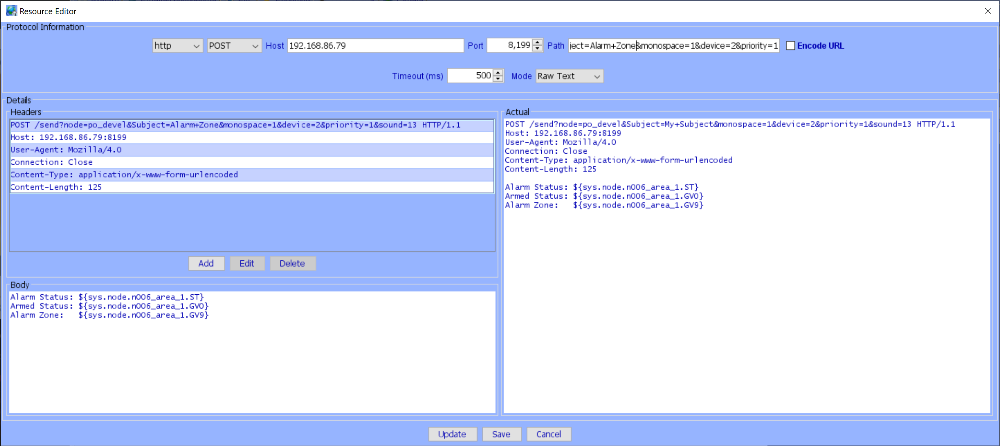

# Polyglot V3 ELK Node server

## Important Notices

I am not responsible for any issues related to this node server including missing an alarm!  However I have been using this in my production enviorment for many months and have had no issues.

### New documentation

There is a [new documentation](https://www.jimboautomates.com/pg3-node-servers#h.xscdgxvkku1o) page I am working on and will transition all the information contained here eventually

## Why use this when ISY has the ELK module?

The ELK Module will not be available on Polisy, the node server will be the supported method.

The node server also has advantages.  It creates a node for Areas, Zones, ... So you can put those nodes in scenes, or use them in programs just like any other node.

This node server works great with the new UD Mobile app for Android and iOS!


## Help

If you have any issues are questions you can ask on [PG3 ELK SubForum](https://forum.universal-devices.com/forum/309-elk/) or report an issue at [PG3 ELK Github issues](https://github.com/UniversalDevicesInc-PG3/udi-poly-ELK/issues).

## Moving from PG2

There are a few ways to move

### Backup and Restore

The best way to move from PG2 to PG3 is to backup on PG2 and restore on PG3, but the only option is to do all your node servers at once.  I don't have much information on this method, if you have questions please ask on the PG3 forum.

### Delete and add

If you can't or don't want backup/restore then you can delete the NS on PG2 and install on the same slot on PG2.  All node addresses will stay the same so all your programs should work after doing an update and save on each one, or rebooting the ISY, especially any using the Controller node since it's ST value has changed.  Just remember to capture the config information before deleting.

### Add then delete

Another option is to install in a new slot then go edit all your programs and scenes that reference the nodes and switch to the new slots. 

## Installation

Install from the Polyglot store.

### Configuration

Open the Configuration Page for the node server in the Polyglot UI and view the [Configuration Help](/POLYGLOT_CONFIG.md) available on that page.

After setting configuration then restart the node server and all configured areas will be added.   There is a Node for each Area, and the Zone's for that area are grouped under it.  Sometimes the ISY fails to actually group some of the nodes, if you notices Zone's not grouped, then right click on it and select Group, which will fix them all.

## Requirements

This uses https://github.com/gwww/elkm1 which currently only supports an M1EXP in local non secure mode.

## Using this Node Server

### General notes

If the Elk objects have characters in the name which are not allowed in ISY Node Names, those charcters will be stripped.

If you change a Elk object name it will not be automatically reflected on the ISY (currently).  You will have to delete the node in the Polyglot UI Node's page for the node server, then restart the node server.

If there is an alarm event, sending a "disarm" with the node server turns off the alarm, but does not reset it, just like when you do it at the Elk keypad.  You will have to send another "disarm" to reset it.  This is mentioned for users of UD Mobile who may want to disarm reset the sytem after an alarm.

#### Syncing profile changes

When the Node server starts up and finishes the sync with the Elk Panel it will build a custom profile which currently contains a list of your user names.  This allows showing the real user name instead of user number.  If you change, add or remove user names you must restart the node server to have them reflected on the ISY.  Also, close and re-open the Admin console if it was open while the node server was restarting.

### Nodes

#### ELK Controller

This has the following status:
- Node Server Online
  - driver; ST
  - Node server up and running
- ELK M1EXP Status:
  - Status of the connection to the M1EXP
  - driver: GV1
  - This was changed in version 3.3.0 and due to a bug in PG3 the driver will not update, so you must delete the controller node in the PG3 UI.  If you have any output nodes, you have to delete those first then delete the controller.  On every long poll the node server will check the conneciton and change it to Connected/Disconnected which will override the other status.
  - Connected: When a successful connection to the ElkM1 is completed.
  - Disconnect: When a connection to a panel is disconnected.
  - Login Sucess: When a login is made to the panel (only when using elks:// connection mode, which is not supported yet in the node server)
  - Login Failed: 
  - Sync Complete: When the panel has completed synchonizing all its elements.
  - Timeout: When a send of a message to the ElkM1 times out (fails to send).
  - Unknown: When a message from the ElkM1 is received and the library does not have a method to decode the message. 
- Node Server Errors
  - This is an integer value of detected errors during node server execution.  I have attempted to trap all possible errors, but there can still be some that are not detected. These show up as ERROR lines in the node server log file, and a notice is also added to the node server page in the PG3 UI.
  - These issues should be reported to [PG# Issues](https://github.com/UniversalDevicesInc-PG3/udi-poly-ELK/issues)
- Remote Programming Status
  - Status of connection from ElkRP program
  - driver: GV2
- System Trouble Status
  - The True/False status of all available system troubles
  - drivers:
    - driver:GV3  AC Fail
    - driver:GV5  Fail To Communicate
    - driver:GV6  EEProm Memory Error
    - driver:GV7  Low Battery Control
    - driver:GV9  Over Current
    - driver:GV10  Telephone Fault
    - driver:GV11  Output 2
    - driver:GV12  Missing Keypad
    - driver:GV13  Zone Expander
    - driver:GV14  Output Expander
    - driver:GV15  ELKRP Remote Access
    - driver:GV16  Common Area Not Armed
    - driver:GV17  Flash Memory Error
    - driver:GV19  Serial Port Expander
    - driver:GV21  GE Smoke CleanMe
    - driver:GV22  Ethernet
    - driver:GV23  Display Message In Keypad Line 1
    - driver:GV24  Display Message In Keypad Line 2

    - You can add this to a notification, change # if you are not using that node to trigger the notification
```
${sys.node.#.GV3}: AC Fail
${sys.node.#.GV5}: Fail To Communicate
${sys.node.#.GV6}: EEProm Memory Error
${sys.node.#.GV7}: Low Battery Control
${sys.node.#.GV9}: Over Current
${sys.node.#.GV10}: Telephone Fault
${sys.node.#.GV11}: Output 2
${sys.node.#.GV12}: Missing Keypad
${sys.node.#.GV13}: Zone Expander
${sys.node.#.GV14}: Output Expander
${sys.node.#.GV15}: ELKRP Remote Access
${sys.node.#.GV16}: Common Area Not Armed
${sys.node.#.GV17}: Flash Memory Error
${sys.node.#.GV19}: Serial Port Expander
${sys.node.#.GV21}: GE Smoke CleanMe
${sys.node.#.GV22}: Ethernet
${sys.node.#.GV23}: Display Message In Keypad Line 1
${sys.node.#.GV24}: Display Message In Keypad Line 2
```

#### Area Node

By default only the area one, is added, change the areas configuraion if you have more than one.  The areas are 1-8, and the node names will match the names defined on your ELK.  They contain the following:
- Alarm Status
  - driver:ST
  - If there is an Alarm
    - No Alarm Active
    - Entrance Delay is Active
    - Alarm Abort Delay Active
    - Fire Alarm
    - Medical Alarm
    - Police Alarm
    - Burglar Alarm
    - Aux 1 Alarm
    - Aux 2 Alarm
    - Aux 3 Alarm
    - Aux 4 Alarm
    - Carbon Monoxide Alarm
    - Emergency Alarm
    - Freeze Alarm
    - Gas Alarm
    - Heat Alarm
    - Water Alarm
    - Fire Supervisory
    - Verify Fire
- Armed Status
  - driver:GV0
  - The current Armed status, can be controlled by the ISY
    - Unknown
      - Only set to this on startup until the status is Known, not settable by user.
    - Disarmed
    - Armed Away
    - Armed Stay
    - Armed Stay Instant
    - Armed Night
    - Armed Night Instant
    - Armed Vacation
    - Armed Next Away Mode (Probably should show this in Set list?)
    - Armed Next Stay Mode (Probably should show this in Set list?)
    - Force Arm To Away Mode (Need to test what this does, bypass?)
    - Force Arm To Stay Mode (Need to test what this does, bypass?)
- Arm Up State
  - driver:GV1
  - The current Arm Up State
    - Unknown (Only on startup)
    - Not Ready To Arm
    - Ready To Arm
    - Ready To Force Arm
    - Armed With Exit Timer
    - Armed Fully
    - Force Armed
    - Armed With Bypass
- Last User
  - driver:GV6
  - The last user to access any keypad with a code.  See "Syncing profile changes" section for more information.
- Chime Mode
  - driver:GV2
    - Off
    - Chime
    - Voice
    - ChimeAndVoice
- Additional Trigger
  - driver:GV10
  - The ELK only sends a triggered zone when a violated zone actually triggers an alarm. If this option is True, which is the default, the Node server will also set Last Triggered Zone when an approriate zone is violated and the ELK is in an Alarm State.
    - If Enabled:
      - In Stay, Away, Night and Vacation Mode, set triggered for any Entry/Exit Delay Nodes when they are violated.
      - In Night mode, set triggered for Night Delay Nodes when they are triggered
- Poll Voltages
  - driver:GV5
  - Enabled to poll the voltages on the Area's Zones.  The ELK doesn't push voltages changes, they must be polled.  By default this is False.  Enabling this creates more traffic so it is off by default.  You can query individual zones to get updates in a program, or enable to have then updated with each short poll.  If you set this to True, you must also enable the Poll Voltage on each zone that you want voltages to be updated.  This polling is doen on short poll intervals.
- Zones Violated
  - driver:GV3
  - The number of Zones currently in Logical Status of Violated, regardless of the Armed Status. This does not mean the zone caused an Alarm, it only means the zone logical status is Violated
- Zones Bypassed
  - driver:GV4
  - The number of Zones currently in Logical Status of bypassed
- Last Violated Zone
  - driver:GV8
  - This is the last zone whose status logical status was Violated, this doesn't mean it caused an Alarm, only means it went Violated
- Last Triggered Zone
  - driver:GV9
  - The zone has caused an alarm to be triggered.  This comes directly from the ELK when the zone is not an entry/exit, or optionally the node server will trigger for other cases. See Additional Trigger above for more informaition.
- Display Message
  Send Text to Keypads in Area
  - Beep: True or False to Beep while displaying the message
  - Clear: 
    - Display until Timeout
      - If timeout not specified, or specified as zero then no timeout
    - Clear Message with * key
      - Allow user to clear message with the * key
    - OFf Timer
      - Specify seconds to show message for
    - Content
      - The Custom Conent from Configuration -> Emails/Notifications -> Customizations
        - If only sending one line then use subject
        - If sending 2 lines then use body and leave subject empty
          - Each line limited to 16 characters
- Clear Message
  - Clears the current message

#### Keypad Node

There is a Keypad node for each keypad found and they are by default grouped under the Area Node they are assigned to. Keypads contain the following.

- Keypad Status
  - Currently always True, may be used in the future
  - driver: ST
- Last User
  - The last user to enter access code at the keyboard, which is also propagated up the the Area Last User
  - driver: GV1
- Temperature
  - The temperature from the keypad, only shown if the keypad reports temperature.
  - driver: GV2
- Last KeyPress
  - The last key pressed on the keypad
  - driver: GV3
- Last Key
  - The last key pressed on the keypad
  - driver: GV3
- Last Function Key
  - The last function pressed on the keypad
  - driver: GV4
  - Includes: F1, F2, F3, F4, F5, F6, Astrick, and Chime

Commands:
  - Query
  - Chime, Star, F1-F6 presses the button on the keypad

##### Keypad Control events

The Key status is not very useful, you should use the Control events for key presses instead as shown in this example progrea.

ELK Key Test - [ID 001C][Parent 0001]
```
If
        'ELK / Home / Master Bedroom' is switched F4
 
Then
        Set 'Notification Controller / UD Mobile' Send Message To JimsPhone Content 8 Notification ID (ID=8)
``` 


#### Zone Node

Currently every Zone in the Area will be added as a Node if the Zone Definition is greater than Zero.  They are grouped under the Area node they are assigned to.  Nodes contain the following:

- Logical Status
  - driver:ST
  - UNKNOWN
  - Normal
  - Trouble
  - Violated
    - Note: This does not meant the zone caused an Alarm, it only means the zone logical status is Violated regardless of the Armed Status.
  - Bypassed
- Physical Status
  - driver:GV0
  - UNKNOWN
  - Unconfigured
  - Open
  - EOL
  - SHORT
- Voltage
  - driver:CV
  - The current Zone Voltage.  Note this is not updated on change, it must be Polled.  By default this is polling is disabled, to enable set "Poll Voltages" on the Zone's Area.  The values are only updated on Short Poll intervals, which can be set in the Node Server Configuration Page.  It is also updated on a Zone query, so you can write ISY progrmas to force the query if you want faster updates, or just to update a single zone.
- Temperature
  - The temperature from the zone, only shown if the zone reports a temperature. Current versions of the ELK system report -60 if the zone doesn't support temperature.
  - driver: CLITEMP
- Triggered Alarm
  - driver:GV1
  - The zone has caused an alarm to be triggered.  This comes directly from the ELK and only turns on if the zone triggers and alarm immediatly, if the zone has entry delay it will not set triggered when zone is violated, or when entry delay times out causing an alarm.
    - True
    - False
- Area
  - driver:GV2
  - The Area number the Zone is part of.
- Type
  - driver:GV3
  - The Zone Type configured in the ELK, 37 different choices
- Send On For / Send Off For
  - driver: GV8 / GV9
  - Allow configuring of when the On and/or Off control signals are sent for the Zone Physical Status changes. This allows you to put the Node in a Scene and by default an On is sent when the Zone changes to Open, and an Off is sent when Zone changes to.  But this can be changed with these options:
    - Ignore
    - Open
    - EOL
    - Short
- Use Off Node
  - driver:GV7
  - Setting this to True will create the Zone Off Node for this Zone, see Zone Off Node below for more information.
- Poll Voltage
  - driver:GV10
  - If the Area Poll Voltage is enabled, then setting this to True for the Zone will poll the voltage on each short poll.
- System Trouble Status
  - The True/False status of all available system troubles
  - drivers:
    - driver:GV4  Box Tamper
    - driver:GV7  Transmitter Low Battery
    - driver:GV17  Security Alert
    - driver:GV19  Lost Transmitter
    - driver:GV25  Fire
    - You can add this to a notification, change # if you are not using that node to trigger the notification
```
Box Tamper:              ${sys.node.#.GV11}
Transmitter Low Battery: ${sys.node.#.GV12}
Security Alert:          ${sys.node.#.GV13}
Lost Transmitter:        ${sys.node.#.GV14}
Fire:                    ${sys.node.#.GV15}
```
  - Toggle Bypass
    - Toggles the bypass state of the zone.  The ELK API doesn't tell us if a zone is bypassable so we have know way of knowing if this should be presented to the user or will actually work.
  - Trigger
    - This sends a zt command to the Elk, which is documented as follows:
```
This command allows a 3rd party integration device to trigger an alarm condition on a EOL hardwired zone
defined with any of the Burglary zone types and many other zone types up to zone type 26. This command
creates a virtual momentary open condition on the zone as if the EOL hardwired loop had been physically opened.
This requires M1 Ver. 4.5.23, 5.1.23 or later.
NOTE: The zt command cannot create a virtual short condition and therefore cannot trigger an alarm
condition for zone types that require a short. E.G. Fire zone alarms cannot be triggered via this command.
```
    Be careful with this, I found if you "trigger" a zone when the system is not armed, then later you arm the system your alarm will go off.  This prints a warning to the log, so you can easily tell when this happens.

#### Zone Off Node

By default only a Zone node is created.  When you enable a Zone "Use Off Node" this will create another node for that Zone which is sent the "Off" commands.   This allows you to have separate nodes for On and Off so they can be in different Scenes if desired.  This is conveinent for turning on a scene when a door opens, but not turning it off when the door closes.  You could also sent 'Send Off For' to None as well, if you never care about the off control message being sent.

#### Thermostat Node

There will be a Thermostat node created under the ELK Controller node for each named thermostat in the ELK.

#### Light Node

The Lights configured on the ELK do not create Light nodes on the ISY.  In versions prior to 3.6.0 it did, but not anymore.  The ISY Light nodes should be deleted, but if they are not then find them in the node server Nodes page and click the delete box to the right of the node.

You can have the Elk Control existing ISY lights and the ISY Light status reflected back to he Elk.  The [Configuration Doc](configdoc.md) which is also on the configuration  page of the node server provides more information. The configuration page also has a table shpwing the status of the Elk to ISY light matches.  

#### Output Node

There will be an Ouput node created for each Output you have listed in the outputs range.  The output is named based on the name in the Elk and has status (ST) showing On, Off, or Unknown.  The Unknown value should only happen when the output is first added until the Elk is queried to get the status.

When an Ouput is turned On or Off, a Control is also sent so you can put the node in a scene, or use Control in a ISY program.

When turning on an ELK output you can specify the seconds as zero which will keep the output on, or set the On Time to the number of seconds to wait before turning off.  You can set the 'Default' time which will be used every time you turn it on, or you can Turn on With Time for a one time execution.

It has these options/commands:
- Default On Seconds
  - The default time the output stays on when turned on, zero means latching so it stays on until turned off
- Turn On for ... Seconds
  - This is one command to turn on for the specified seconds, or zero for latching

The output node can be put in a scene as a controller and when the ELK turns it on or off it can control the scene.

#### Counter Node

There will be a Counter node created under the Controller for each Counter that is not using the default name.  So if you named the counter in the ELK it will show up.

The counter value can be set directly, incremented or decremented.  Currently it is not possible to set the value to zero.

#### Task Node

There will be a Task node created under the Controller for each Task that is not using the default name.  So if you named the task in the ELK it will show up.

The Task has a Status which is currently meaningless, but someday will show the date/time of last execution when ISY supports it.

The only command for a task is Activate

## Using the Node server

Following are examples have usages for this node server.

### Notifications

To include any information about a Zone in a notification you can use any if these drivers:
```
Area: ${sys.node.n004_area_1.name}
 Alarm Status:        ${sys.node.n004_area_1.ST}
 Armed Status:        ${sys.node.n004_area_1.GV0}
 Arm Up State:        ${sys.node.n004_area_1.GV1}
 Last Violated Zone:  ${sys.node.n004_area_1.GV8}
 Last Triggered Zone: ${sys.node.n004_area_1.GV9}
 Chime Mode:          ${sys.node.n004_area_1.GV2}
 Zones Violated:      ${sys.node.n004_area_1.GV3}
 Zones Bypassed:      ${sys.node.n004_area_1.GV4}
 Last user:           ${sys.node.n004_area_1.GV6}
 Last Keypad:         ${sys.node.n004_area_1.GV7}

${sys.node.n004_zone_1.name} ${sys.node.n004_zone_1.status}
${sys.node.n004_zone_2.name} ${sys.node.n004_zone_2.status}
...
```

### Triggered Zone

The new Area Last Triggered Zone makes it easy to send a notification for Zone which started an alarm.  I use the Notificaiton Node server so the program looks like this:
```
ELK Alarm Zone - [ID 0025][Parent 0001]

If
        'ELK / Home' Last Triggered Zone is not Unknown

Then
        Resource 'ELK Alarm Zone'

Else
   - No Actions - (To add one, press 'Action')
```
The notification resource is also very simple as shown in the Network Resource.


This can be adapated to your prefered notification method.


## TODO and issues

https://github.com/UniversalDevicesInc-PG3/udi-poly-ELK/issues

## Changelog

Release notes now live in [`CHANGELOG.md`](CHANGELOG.md).
